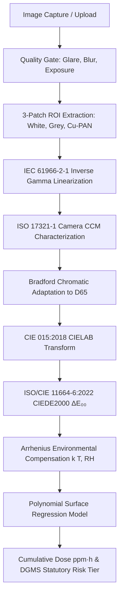

# Cu-PAN Colorimetric H₂S Dosimeter System (SIH26118)

[](h2s_dosimeter/tests/)
[](test-strip-lifecycle.js)
[](test-cumulative-retraining.js)
[](test-e2e.js)
[](shared/colorimetricStandards.js)
[--PAN)-indigo?style=flat-square)](h2s_dosimeter/config/strip_calibration.json)

> **SIH26118 Project Summary**: A field-deployable, non-invasive optical dosimetry platform that estimates cumulative occupational $\text{H}_2\text{S}$ exposure ($\text{ppm}\cdot\text{h}$) by quantifying the chromatic transition of immobilized **Cu-PAN (Copper(II)-1-(2-pyridylazo)-2-naphthol)** strips under ambient and lighting-compensated conditions.

---

## Table of Contents
1. [Chemical Sensing Principle](#1-chemical-sensing-principle)
2. [Disposable Strip Lifecycle & Remaining Sensing Capacity](#2-disposable-strip-lifecycle--remaining-sensing-capacity)
3. [Cumulative Master Retraining & Versioning Engine](#3-cumulative-master-retraining--versioning-engine)
4. [Calibration & Model Dashboard Module](#4-calibration--model-dashboard-module)
5. [Worker Registration & Access Control Architecture](#5-worker-registration--access-control-architecture)
6. [Optical Metrology Pipeline](#6-optical-metrology-pipeline)
7. [Statutory Limits & Risk Policy](#7-statutory-limits--risk-policy)
8. [Project Structure](#8-project-structure)
9. [Running & Verification Instructions](#9-running--verification-instructions)

---

## 1. Chemical Sensing Principle

The sensing chemistry is based on the coordination complex of **copper(II) with 1-(2-pyridylazo)-2-naphthol (Cu-PAN)** immobilized on a solid porous substrate (regenerated cellulose matrix):

```text
Cu(II)-PAN complex (Purple / Deep Violet)
        +
H₂S (Gaseous Sulfide)
        ↓
Sulfide coordination & displacement of Cu(II)
        ↓
CuS precipitation + Free H-PAN dye release
        ↓
Visible Chromatic Transition: PURPLE/VIOLET → YELLOW/ORANGE
```

- **Unexposed Virgin Baseline**: $L_0^* = 42.50, a_0^* = 38.20, b_0^* = -28.40$ (Deep Purple).
- **Reacted Saturated State**: $L^* = 72.80, a^* = 14.50, b^* = 62.00$ (Intense Yellow/Orange).
- **Dosimetry Unit**: The statutory output is strictly cumulative exposure dose in **`ppm·h`** ($\text{Dose} = \int_0^t C(\tau) d\tau$).

---

## 2. Disposable Strip Lifecycle & Remaining Sensing Capacity

The system tracks two decoupled lifecycles:

1. **Storage Shelf Life**: Pre-opening expiration ($T < \text{storage\_expiry\_at}$).
2. **Active Sensing Capacity**: Cumulative chemical exposure limit against the experimentally validated operating domain ($D_{\text{max}} = 160.0\text{ ppm·h}$):

$$L_{\text{remaining}} = 100\left(1 - \frac{D_{\text{cumulative}}}{D_{\text{max}}}\right), \quad L_{\text{used}} = 100 \times \frac{D_{\text{cumulative}}}{D_{\text{max}}}$$

- **Status Tiers**:
  - $> 30\%$ remaining: `● STRIP GOOD`
  - $10\text{--}30\%$ remaining: `⚠ STRIP NEAR END OF LIFE (REPLACE SOON)`
  - $\le 10\%$ remaining: `✕ REPLACE STRIP NOW (SENSING CAPACITY EXHAUSTED)`
- **Backend Gate**: Scans on exhausted strips are immediately rejected with `400 Bad Request` (`STRIP_EXHAUSTED`).
- **Post-Scan Result Card**: The mobile capture app immediately displays the primary H₂S exposure along with the dedicated **Current Cu-PAN Strip** sensing life progress bar and quick replacement button.

---

## 3. Cumulative Master Retraining & Versioning Engine

### Fundamental Cumulative Invariant
Every time new validated experimental calibration data are approved, the system builds the next model using the **complete cumulative master dataset**:

$$\text{Master}_{v(N+1)} = \text{Master}_{v(N)} + \text{New Validated Laboratory Data}$$

```text
CUPAN-DATA-v1 (50 real samples)  ──→ CUPAN-MODEL-v1 (MAE: 24.50 ppm·h)
        ↓ +50 samples
CUPAN-DATA-v2 (100 real samples) ──→ CUPAN-MODEL-v2 (MAE: 20.80 ppm·h)
        ↓ +100 samples
CUPAN-DATA-v3 (200 real samples) ──→ CUPAN-MODEL-v3 (MAE: 17.00 ppm·h)
        ↓ +50 samples
CUPAN-DATA-v4 (250 real samples) ──→ CUPAN-MODEL-v4 (MAE: 13.40 ppm·h) [PUBLISHED]
```

### Key Retraining Capabilities
- **Zero-Leakage GroupKFold Partitioning**: Real source samples are partitioned into Train ($70\%$), Validation ($15\%$), and Test ($15\%$) **before augmentation**; validation and test sets remain 100% untouched real laboratory data.
- **Candidate Training & Side-by-Side Comparison**: New models are trained in `DRAFT` state and evaluated side-by-side with the current production model on $\Delta \text{MAE}$, $\Delta \text{RMSE}$, and $\Delta R^2$.
- **Supervisor Publishing & One-Click Rollback**: Published models become active across all mobile and fleet endpoints; supervisors can roll back to any historical model snapshot without data loss.
- **Coverage Heatmap & Testing Priority**: 2D density matrix over Dose ($0\text{--}160\text{ ppm·h}$) $\times$ Temperature ($15\text{--}40^\circ\text{C}$) identifies undersampled regions and recommends high-priority targets.

---

## 4. Calibration & Model Dashboard Module

The Supervisor Dashboard includes a dedicated first-class **Calibration & Model** interface:

- **Top KPI Metrics**: Cumulative Real Samples ($250$), Published Model (`CUPAN-MODEL-v4`), Held-out Test $R^2$ ($0.9320$), Test MAE ($13.40\text{ ppm·h}$).
- **Graph 1: Cu-PAN Calibration Curve**: $\Delta E_{00}$ vs Dose with real experimental markers and fitted surface curve.
- **Graph 2: CIELAB Progression Curves**: Interactive $L^*$, $a^*$, $b^*$ response tabs.
- **Graph 3: Predicted vs Actual Dose**: Test set scatter against the ideal $y=x$ dashed diagonal line.
- **Graph 4: Residual Error Distribution**: Bias detection ($Residual = Predicted - Actual$) around zero error baseline.
- **Graph 5: Historical Dataset Growth & Accuracy Trends**: Live curves tracking real sample growth and error reduction over versions.
- **2D Density Matrix Heatmap & Priority Recommendation**: Guides future laboratory chamber testing.
- **Cu-PAN Reference Colour Scale & Optical Pipeline**: Visual swatch reference and step-by-step colorimetric conversion diagram.
- **250-Case Master Dataset Ledger**: Paginated sample ledger with search and CIELAB coordinates.

---

## 5. Worker Registration & Access Control Architecture

```text
UNREGISTERED WORKER ──→ [ 403 FORBIDDEN: WORKER_NOT_REGISTERED ] ──→ Blocked
INACTIVE WORKER     ──→ [ 403 FORBIDDEN: WORKER_BLOCKED ]        ──→ Blocked
REGISTERED WORKER   ──→ Valid Active Strip Assigned               ──→ PIC SCAN Allowed
                                                                           ↓
                                                                  Cumulative Dose Logged
                                                                           ↓
                                                                  Remaining Life Updated
```

- Unregistered or blocked workers are strictly prevented from performing scans.
- Each scan logs the `model_version` (`CUPAN-MODEL-v4`), `dataset_version` (`CUPAN-DATA-v4`), and `strip_id` for immutable regulatory audit trails.

---

## 6. Optical Metrology Pipeline



---

## 7. Statutory Limits & Risk Policy

| Risk Tier | Cumulative Dose ($\text{ppm}\cdot\text{h}$) | 8-Hr TWA Equivalent | Regulatory Standard & Prescribed Action |
|---|---|---|---|
| **SAFE** | $0.0 - 8.0$ | $<1.0\text{ ppm}$ | ACGIH TLV-TWA shift baseline. Normal operations. |
| **CAUTION** | $8.0 - 24.0$ | $1.0 - 3.0\text{ ppm}$ | Approaching ACGIH TWA threshold. Check ventilation. |
| **WARNING** | $24.0 - 40.0$ | $3.0 - 5.0\text{ ppm}$ | ACGIH 15-min STEL ($5\text{ ppm}$) / 50% DGMS shift limit. |
| **ALERT** | $40.0 - 80.0$ | $5.0 - 10.0\text{ ppm}$ | NIOSH REL Ceiling ($10\text{ ppm}$). Mandatory PPE. |
| **DANGER** | $80.0 - 160.0$ | $>10.0\text{ ppm}$ | **Exceeded Indian DGMS $80\text{ ppm}\cdot\text{h}$ Shift Limit**. Evacuate sector. |
| **LIFE THREATENING** | $>160.0$ | $>20.0\text{ ppm}$ | Approaching NIOSH IDLH ($100\text{ ppm}$). Immediate rescue. |

---

## 8. Project Structure

```text
H2S-DOSIMETER/
├── h2s_dosimeter/              # Core Python Metrological Engine
│   ├── calibration/            # Datasets, Cu-PAN spline & polynomial models
│   ├── camera/                 # Camera profiling, CCM solver
│   ├── color/                  # IEC 61966-2-1, Bradford CAT, CIEDE2000
│   ├── config/                 # strip_calibration.json, cupan_dataset_200.json
│   ├── dosimetry/              # Arrhenius kinetics, multi-shift tracker, risk policy
│   ├── scripts/                # cumulative_trainer.py, generate_calibration_suite.py
│   └── tests/                  # 53 pytest unit and integration tests
├── data/                       # Immutable Master Dataset & Model Version Storage
│   ├── master/                 # CUPAN-DATA-v1.json to CUPAN-DATA-v4.json
│   ├── incoming/               # Pending validation queue
│   └── rejected/               # Rejected samples
├── backend/                    # Node.js / Express API Gateway & MongoDB Store
│   ├── src/controllers/        # readingController, stripController, modelCalibrationController
│   ├── src/models/             # Worker.js, Strip.js, StripBatch.js, Reading.js
│   ├── src/routes/             # workerRoutes, stripRoutes, calibrationRoutes
│   └── src/server.js           # API Gateway (ports: 5000)
├── mobile-app/                 # React / Vite Field PWA
│   └── src/screens/            # WorkerIdScreen, ResultScreen (with Strip Capacity Card)
├── dashboard/                  # React / Vite Safety Supervisor Fleet Portal
│   ├── src/pages/              # Overview, WorkerHistory, BatchesPage, CalibrationModelPage, DGMSReport
│   └── src/components/         # CuPanReferenceScale, ModelComparisonModal, AddCalibrationDataModal
├── test-cumulative-retraining.js # Automated 11-test suite for cumulative retraining
├── test-strip-lifecycle.js       # Automated 10-test suite for registration & strip lifecycle
└── test-e2e.js                   # Automated 12-test end-to-end API pipeline test
```

---

## 9. Running & Verification Instructions

### 1. Python Metrological Engine Tests
```bash
pytest -v h2s_dosimeter/tests
```

### 2. Cumulative Retraining Engine CLI
```bash
python -m h2s_dosimeter.scripts.cumulative_trainer --action train_candidate
```

### 3. Backend Setup & Seeding
```bash
cd backend
npm install
npm run seed
npm start
```

### 4. Client Applications
```bash
# Mobile Field App (http://localhost:5173)
cd mobile-app && npm install && npm run dev

# Supervisor Dashboard (http://localhost:5174)
cd dashboard && npm install && npm run dev
```

### 5. Automated Verification Test Suites
```bash
# 1. Cumulative Retraining & Rollback Test Suite
node test-cumulative-retraining.js

# 2. Worker Registration & Strip Lifecycle Test Suite
node test-strip-lifecycle.js

# 3. End-to-End System Pipeline Test Suite
node test-e2e.js
```

---

## License
Developed for Smart India Hackathon **SIH26118**. Distributed under the Apache 2.0 License.
